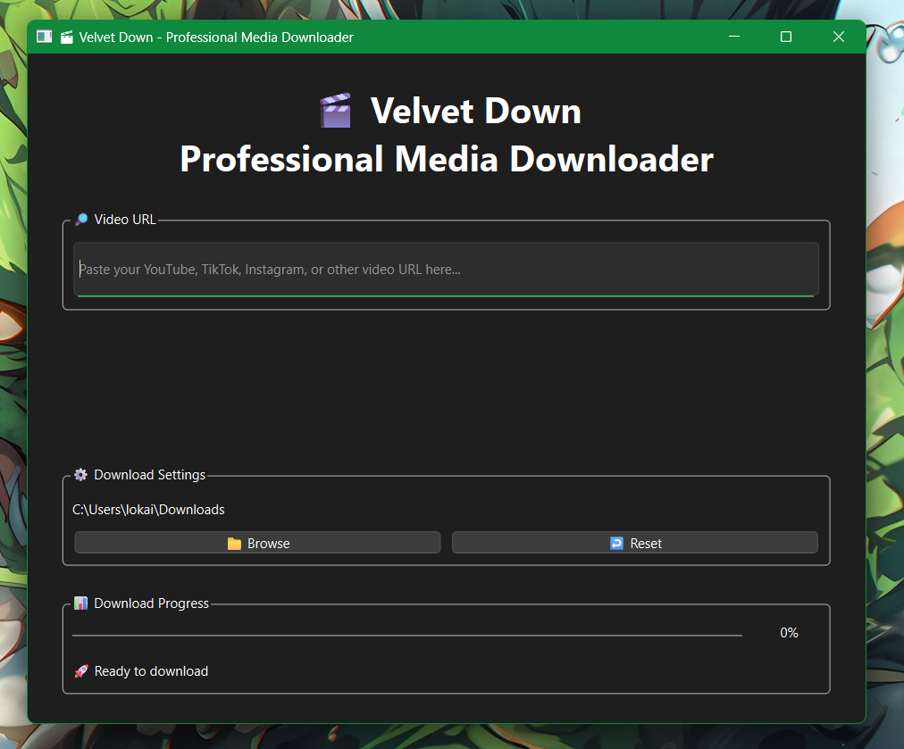
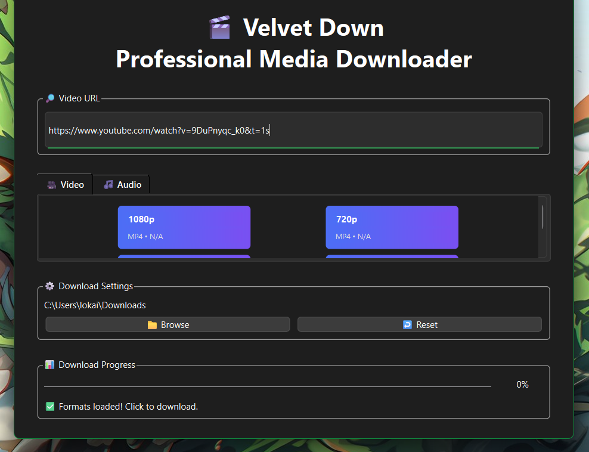
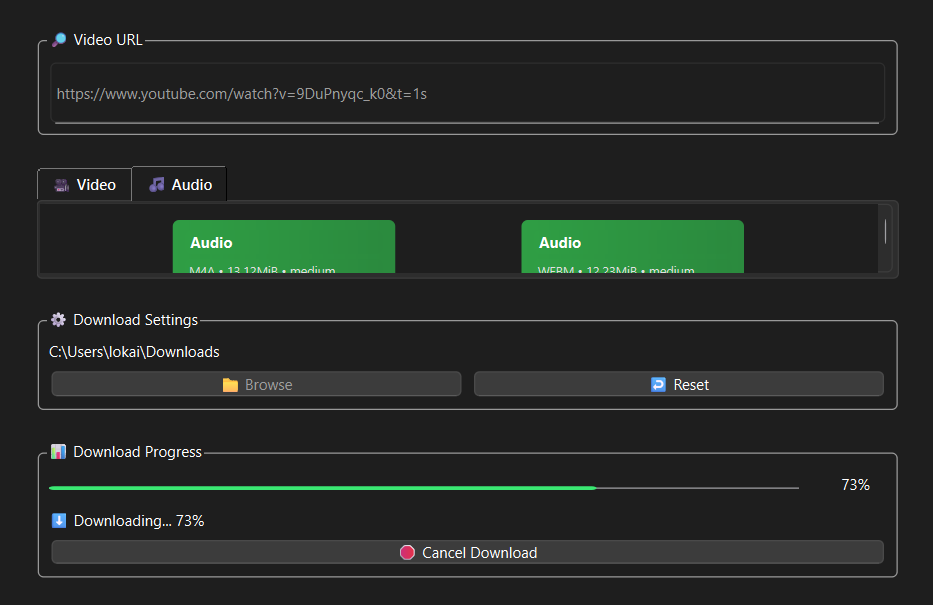

# 🎬 Velvet Down - Professional YouTube Downloader

A modern, elegant desktop application for downloading videos from YouTube and other platforms. Built with Python and PyQt6, featuring a beautiful gradient UI and smooth download experience.



## ✨ Features

- 🎯 **Multi-Quality Support** - Download in 360p, 480p, 720p, or 1080p
- 🎵 **Audio Extraction** - Download audio-only in MP3, M4A, or WEBM formats
- 📊 **Real-Time Progress** - Live download progress with speed and ETA
- 🎨 **Modern UI** - Beautiful gradient interface with smooth animations
- 📁 **Smart File Management** - Downloads to temp folder, only shows final file
- 🔄 **Auto-Merge** - Automatically merges video and audio streams
- 🚀 **Fast & Reliable** - Powered by yt-dlp and ffmpeg
- 🌐 **Multi-Platform** - Works on Windows, macOS, and Linux

## 🖼️ Screenshots

| Format Selection | Download Progress |
|-----------------|-------------------|
|  |  |

## 🚀 Quick Start

### Prerequisites

- Python 3.8 or higher
- pip (Python package manager)

### Installation

1. **Clone the repository**
   ```bash
   git clone https://github.com/LokaiRipon/velvet-downloader.git
   cd velvet-down
   ```

2. **Install dependencies**
   ```bash
   pip install -r requirements.txt
   ```

3. **Run the application**
   ```bash
   python main.py
   ```

## 📥 Download Executable

Don't want to install Python? Download the standalone executable:

- [Windows (x64)](https://github.com/LokaiRipon/velvet-downloader/releases/latest/download/VelvetDown-Windows.exe)
- [macOS (Apple Silicon)](https://github.com/LokaiRipon/velvet-downloader/releases/latest/download/VelvetDown-macOS.dmg)
- [Linux (AppImage)](https://github.com/LokaiRipon/velvet-downloader/releasesloader/latest/download/VelvetDown-Linux.AppImage)

## 🎯 Usage

1. **Paste URL** - Copy a YouTube video URL and paste it into the input field
2. **Choose Quality** - Select your preferred video quality or audio-only format
3. **Click to Download** - Click any format card to start downloading
4. **Open File** - After download completes, click "Open Video" to view

## 🛠️ Tech Stack

- **Frontend**: PyQt6 (Modern Python GUI framework)
- **Backend**: 
  - yt-dlp (Video extraction and downloading)
  - ffmpeg (Media processing and merging)
- **Architecture**: Model-View-Controller (MVC) pattern
- **Async Processing**: QProcess for non-blocking downloads

## 🏗️ Project Structure

```
velvet-down/
├── main.py          # Application entry point
├── app.py           # Main window and UI logic
├── downloader.py    # Download management and yt-dlp integration
├── ui_new.py        # Format card components
├── requirements.txt # Python dependencies
└── assets/          # Icons and resources
```

## 🔧 Building from Source

### Build Executable

**Windows:**
```bash
pip install pyinstaller
pyinstaller --onefile --windowed --icon=icon.ico --name="VelvetDown" main.py
```

**macOS:**
```bash
pip install pyinstaller
pyinstaller --onefile --windowed --icon=icon.icns --name="VelvetDown" main.py
```

**Linux:**
```bash
pip install pyinstaller
pyinstaller --onefile --windowed --icon=icon.png --name="VelvetDown" main.py
```

## 🤝 Contributing

Contributions are welcome! Please feel free to submit a Pull Request.

1. Fork the project
2. Create your feature branch (`git checkout -b feature/AmazingFeature`)
3. Commit your changes (`git commit -m 'Add some AmazingFeature'`)
4. Push to the branch (`git push origin feature/AmazingFeature`)
5. Open a Pull Request

## 📜 License

This project is licensed under the MIT License - see the [LICENSE](MIT) file for details.

## ⚠️ Disclaimer

This tool is for personal use only. Please respect copyright laws and YouTube's Terms of Service. Do not use this tool to download copyrighted content without permission.

## 🙏 Acknowledgments

- [yt-dlp](https://github.com/yt-dlp/yt-dlp) - Amazing video downloader
- [PyQt6](https://www.riverbankcomputing.com/software/pyqt/) - Powerful Python GUI framework
- [ffmpeg](https://ffmpeg.org/) - Essential media processing tool

## 📧 Contact

Lokai Eripon - [@LokaiRipon](https://twitter.com/yourtwitter) - lokaieripon@gmail.com

Project Link: [https://github.com/LokaiRipon/velvet-downloader](https://github.com/LokaiRipon/velvet-downloader)

---

⭐ Star this repo if you find it useful!